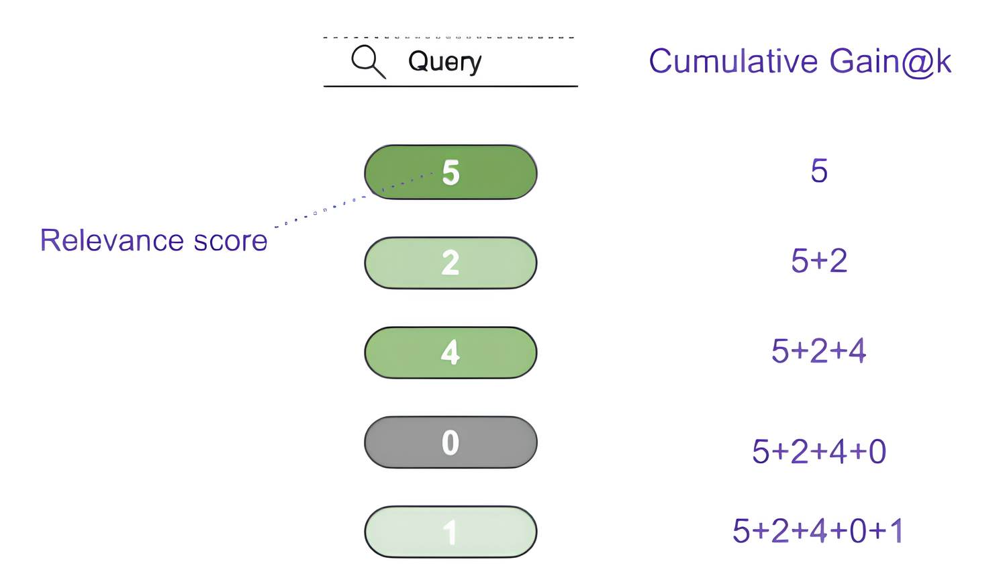

# Evaluation Metrics for Information Retrieval

Author: Kumar Utsav<br>
Date: June 18, 2024

This document focuses exclusively on offline evaluation metrics for Information Retrieval (IR) systems, setting aside online evaluation methods such as click-through rates or A/B testing. Offline evaluation allows for the quantitative comparison of multiple IR models using labeled datasets, which map queries to relevant documents. These documents can be graded on a relevance scale (e.g., 0-5) or simply marked as relevant/non-relevant (binary).

Labeled data is typically derived from manual annotations or click data, and a single query can be associated with multiple relevant documents, as seen in TREC collections or the MSMARCO dataset, which presents its own set of challenges and benefits.

## Binary labels

### Precision@k

Precision@k corresponds to the number of relevant documents among top k retrieved documents.

<p align="center">
$\text{Precision@}k = \frac{\text{TP@}k}{\text{TP@}k + \text{FP@}k}$
</p>

<p align="center">

</p>

<p align="center">
​Fig. 1. Illustration of Precision@k for evaluating IR models.
</p>

Precision fails to take into account the ordering of the relevant documents. For example consider the models A and B (Fig 2) where model A outputs `[1,1,1,0,0]`(first 3 relevant) and model B outputs `[0,0,1,1,1]`(indices 3-5 relevant); both the models get the same score Precision@5=3/5.

### MAP@k: Mean Average Precision

Average Precision(AP) evaluates whether all the relevant items selected by the model are ranked higher or not. Every time we find a relevant document, we look at the full picture of what came before.

MAP squeezes complex evaluation into a single number. It’s essentially the mean of AP over all the queries.

<p align="center">
$AP@k(q) = \frac{\sum\limits_{i=1}^{k} P(q)@i \cdot \text{rel}(q)_i}{|\text{rel}(q)|}$
</p>

<p align="center">
$MAP@k(Q) = \frac{1}{|Q|} \sum_{q \in Q} AP@k(q)$
</p>

Where $|Q|$ is the number of queries, $P(q)@i$ is the precision of query $q$ after the first $i$ documents, $\text{rel}(q)_i$ is the binary relevance of the document at position $i$, and $|\text{rel}(q)|$ is the number of relevant documents.

<p align="center">

</p>

<p align="center">
Fig. 2. Illustration of AveragePrecision@k for evaluating IR models.
</p>

### MRR: Mean Reciprocal Rank

MRR puts focus on the first relevant document. It’s applicable when the system needs to return only the top matching document or the user only cares about the top result.

<p align="center">
$MRR(Q) = \frac{1}{|Q|} \sum_{q \in Q} \frac{1}{\text{FirstRank}(q)}$
</p>

Where ∣Q∣ is the number of queries and FirstRank(q) is the returns the rank of first relevant dcuments for 1 query.

MRR(for 1 query) for different positions can be seen below. Notice the sharp fall in the values beyond the top few places.

```python
import math
import matplotlib.pyplot as plt
%matplotlib inline

N = 20
plt.figure(figsize=(16, 5));
plt.plot(range(1, N+1), [1/n for n in range(1, N+1)], c="b", label="1/x");
plt.legend();
plt.xticks(range(1, N+1, 1));
```

<p align="center">

</p>

Fig. 3. FirstRank for various indices.

> Note that the metrics related to Recall are not used in general because it is easy to achieve a recall of 100% by returning all documents for a query.

## Graded labels

### nDCG@k: Normalized Discounted Cumulative Gain

To understand nDCG, first let’s look at CG i.e. Cumulative Gain. We simply add up the relevance scores for top k documents returned for a query.

<p align="center">
$CG@k(q) = \sum\limits_{i=1}^{k} \text{rel}_i(q)$
</p>

<p align="center">

</p>

<p align="center">
Fig. 3. Illustration of CumulativeGain@k for evaluating IR models.
</p>

Note that CG does not take into account the position of the document. For example consider the models A and B where model A outputs `[5,2,4,0,1]` and model B outputs `[2,0,5,1,4]`; both the models get the same score CG@5=12.

DCG i.e. Discounted Cumulative Gain improves on CG by adding a discounting factor for each position.

<p align="center">
$DCG@k(q) = \sum\limits_{i=1}^{k} \frac{\log_2(i+1)}{rel(q)_i}$
</p>

here $\text{rel}(q)_i$ is the graded relevance of doc at position i.

```python
import math
from typing import List
import pandas as pd


def dcg_df_from_scores(scores: List[int]) -> pd.DataFrame:
    cols = ["position(i)", "relevance(i)", "log2(i+1)", "relevance(i) / log2(i+1)"]

    data = []
    for i, score in enumerate(scores):
        position = i + 1
        data.append((position, score, math.log2(position+1), score / math.log2(position+1)))

    return pd.DataFrame(data, columns=cols)


def dcg_at_k(scores: List[int]) -> pd.DataFrame:
    df = dcg_df_from_scores(scores)
    dcg_so_far = ""

    for i, dcg in enumerate(df["relevance(i) / log2(i+1)"]):
        if not dcg_so_far:
            dcg_so_far = f"{dcg:2.2f}"
        else:
            dcg_so_far = f"{dcg_so_far} + {dcg:2.2f}"
        print(f"DCG@{i+1} = {dcg_so_far:<32} = {eval(dcg_so_far):2.2f}")
    
    return df
```

Now we can compare the results from the two models A and B we mentioned earlier.

```python
get_dcg_at_k([5, 2, 4, 0, 1])  # model A

# DCG@1 = 5.00                             = 5.00
# DCG@2 = 5.00 + 1.26                      = 6.26
# DCG@3 = 5.00 + 1.26 + 2.00               = 8.26
# DCG@4 = 5.00 + 1.26 + 2.00 + 0.00        = 8.26
# DCG@5 = 5.00 + 1.26 + 2.00 + 0.00 + 0.39 = 8.65
```

| ix | position(i) | relevance(i) | log2(i+1) | relevance(i) / log2(i+1) |
|----|-------------|--------------|-----------|--------------------------|
| 0  | 1           | 5            | 1.000000  | 5.000000                 |
| 1  | 2           | 2            | 1.584963  | 1.261860                 |
| 2  | 3           | 4            | 2.000000  | 2.000000                 |
| 3  | 4           | 0            | 2.321928  | 0.000000                 |
| 4  | 5           | 1            | 2.584963  | 0.386853                 |


```python
get_dcg_at_k([2, 0, 5, 1, 4])  # model B

# DCG@1 = 2.00                             = 2.00
# DCG@2 = 2.00 + 0.00                      = 2.00
# DCG@3 = 2.00 + 0.00 + 2.50               = 4.50
# DCG@4 = 2.00 + 0.00 + 2.50 + 0.43        = 4.93
# DCG@5 = 2.00 + 0.00 + 2.50 + 0.43 + 1.55 = 6.48
```

| ix  | position(i) | relevance(i) | log2(i+1) | relevance(i) / log2(i+1) |
|-----|-------------|--------------|-----------|--------------------------|
| 0   | 1           | 2            | 1.000000  | 2.000000                 |
| 1   | 2           | 0            | 1.584963  | 0.000000                 |
| 2   | 3           | 5            | 2.000000  | 2.500000                 |
| 3   | 4           | 1            | 2.321928  | 0.430677                 |
| 4   | 5           | 4            | 2.584963  | 1.547411                 |


DCG solves the problem with CG but it also has a drawback, it can’t be used to compare queries/models that return different number of results. For example consider query A and B where query A returns `[5,2,4]` query B returns `[5,2,4,0,1]`;

```python
get_dcg_at_k([5, 2, 4])  # query A

# DCG@1 = 5.00                             = 5.00
# DCG@2 = 5.00 + 1.26                      = 6.26
# DCG@3 = 5.00 + 1.26 + 2.00               = 8.26
```

| ix | position(i) | relevance(i) | log2(i+1) | relevance(i) / log2(i+1) |
|----|-------------|--------------|-----------|--------------------------|
| 0  | 1           | 5            | 1.000000  | 5.00000                  |
| 1  | 2           | 2            | 1.584963  | 1.26186                  |
| 2  | 3           | 4            | 2.000000  | 2.00000                  |

```python
get_dcg_at_k([5, 2, 4, 0, 1])  # query B

# DCG@1 = 5.00                             = 5.00
# DCG@2 = 5.00 + 1.26                      = 6.26
# DCG@3 = 5.00 + 1.26 + 2.00               = 8.26
# DCG@4 = 5.00 + 1.26 + 2.00 + 0.00        = 8.26
# DCG@5 = 5.00 + 1.26 + 2.00 + 0.00 + 0.39 = 8.65
```

| ix position(i) | relevance(i) | log2(i+1) | relevance(i) / log2(i+1) |
|----------------|--------------|-----------|---------------------------|
| 0              | 5            | 1.000000  | 5.000000                  |
| 1              | 2            | 1.584963  | 1.261860                  |
| 2              | 4            | 2.000000  | 2.000000                  |
| 3              | 0            | 2.321928  | 0.000000                  |
| 4              | 1            | 2.584963  | 0.386853                  |

Query B got higher DCG because it returned 5 documents whereas query A only returned 3. We can’t say that query B was better than query A. nDCG fixes this issue by adding a normalization factor on top of DCG.

<p align="center">
$\text{nDCG@k}(Q) = \frac{1}{|Q|} \sum_{q \in Q} \frac{\text{DCG@k}(\text{sorted}(\text{rel}(q)))}{\text{DCG@k}(q)}$
</p>

Where ∣Q∣ is the number of queries.

The normalization factor 𝐷𝐶𝐺@𝑘(𝑠𝑜𝑟𝑡𝑒𝑑(𝑟𝑒𝑙(𝑞))) is the Ideal DCG@k. This is calculated by sorting the graded relevance scores returned for a query and then calculating the DCG@k. nDCG@k always lie between 0 and 1.

Now we can compare queries/models with different number of results.

```python
get_dcg_at_k(sorted([5, 2, 4], reverse=True))  # Ideal DCG@k for query A

# DCG@1 = 5.00                             = 5.00
# DCG@2 = 5.00 + 2.52                      = 7.52
# DCG@3 = 5.00 + 2.52 + 1.00               = 8.52
```

| ix position(i) | relevance(i) | log2(i+1) | relevance(i) / log2(i+1) |
|----------------|--------------|-----------|---------------------------|
| 0              | 1            | 5.000000  | 1.000000                  |
| 1              | 2            | 4.000000  | 1.584963                  |
| 2              | 3            | 2.000000  | 2.523719                  |
| 3              | 4            | 1.584963  | 2.523719                  |

nDCG@3 for query A = 8.26 / 8.52 = 0.9694

```python
get_dcg_at_k(sorted([5, 2, 4, 0, 1], reverse=True))  # Ideal DCG@k for query B

# DCG@1 = 5.00                             = 5.00
# DCG@2 = 5.00 + 2.52                      = 7.52
# DCG@3 = 5.00 + 2.52 + 1.00               = 8.52
# DCG@4 = 5.00 + 2.52 + 1.00 + 0.43        = 8.95
# DCG@5 = 5.00 + 2.52 + 1.00 + 0.43 + 0.00 = 8.95
```

| ix position(i) | relevance(i) | log2(i+1) | relevance(i) / log2(i+1) |
|----------------|--------------|-----------|--------------------------|
| 0              | 5            | 1.000000  | 5.000000                 |
| 1              | 4            | 1.584963  | 2.523719                 |
| 2              | 2            | 2.000000  | 1.000000                 |
| 3              | 1            | 2.321928  | 0.430677                 |
| 4              | 0            | 2.584963  | 0.000000                 |

nDCG@5 for query B = 8.65 / 8.95 = 0.9664

## References

- Sebastian Hofstätter: “Advanced Information Retrieval 2021 @ TU Wien”
- Amit Chaudhary: https://amitness.com/2020/08/information-retrieval-evaluation
